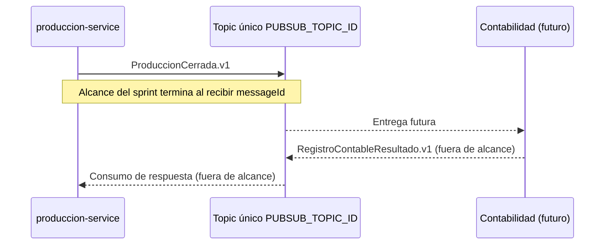

# Flujo Contabilidad v1

```mermaid
sequenceDiagram
    participant P as produccion-service
    participant T as Topic único PUBSUB_TOPIC_ID
    participant C as Contabilidad (futuro)
    P->>T: ProduccionCerrada.v1
    Note over P,T: Alcance del sprint termina al recibir messageId
    T-->>C: Entrega futura
    C-->>T: RegistroContableResultado.v1 (fuera de alcance)
    T-->>P: Consumo de respuesta (fuera de alcance)
```
