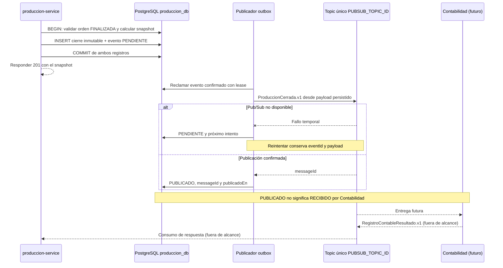

# Flujo Contabilidad v1

```mermaid
sequenceDiagram
    participant P as produccion-service
    participant DB as PostgreSQL produccion_db
    participant O as Publicador outbox
    participant T as Topic único PUBSUB_TOPIC_ID
    participant C as Contabilidad (futuro)
    P->>DB: BEGIN: validar orden FINALIZADA y calcular snapshot
    P->>DB: INSERT cierre inmutable + evento PENDIENTE
    P->>DB: COMMIT de ambos registros
    P-->>P: Responder 201 con el snapshot
    O->>DB: Reclamar evento confirmado con lease
    O->>T: ProduccionCerrada.v1 desde payload persistido
    alt Pub/Sub no disponible
        T--xO: Fallo temporal
        O->>DB: PENDIENTE y próximo intento
        Note over O,T: Reintentar conserva eventId y payload
    else Publicación confirmada
        T-->>O: messageId
        O->>DB: PUBLICADO, messageId y publicadoEn
    end
    Note over DB,C: PUBLICADO no significa RECIBIDO por Contabilidad
    T-->>C: Entrega futura
    C-->>T: RegistroContableResultado.v1 (fuera de alcance)
    T-->>P: Consumo de respuesta (fuera de alcance)
```
