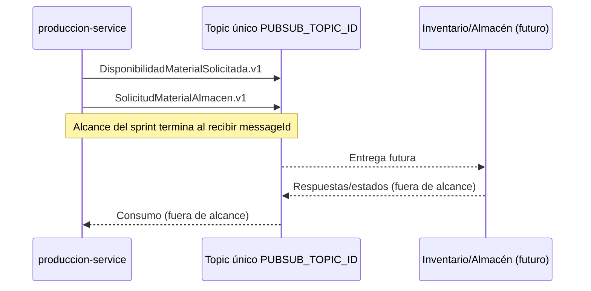

# Flujo Inventario/Almacén v1

```mermaid
sequenceDiagram
    participant P as produccion-service
    participant T as Topic único PUBSUB_TOPIC_ID
    participant I as Inventario/Almacén (futuro)
    P->>T: DisponibilidadMaterialSolicitada.v1
    P->>T: SolicitudMaterialAlmacen.v1
    Note over P,T: Alcance del sprint termina al recibir messageId
    T-->>I: Entrega futura
    I-->>T: Respuestas/estados (fuera de alcance)
    T-->>P: Consumo (fuera de alcance)
```
