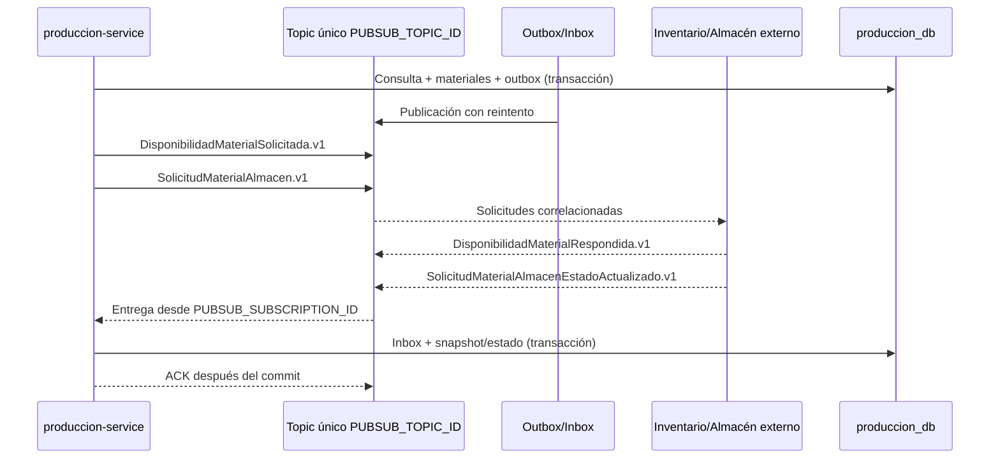

# Flujo Inventario/Almacén v1

```mermaid
sequenceDiagram
    participant P as produccion-service
    participant T as Topic único PUBSUB_TOPIC_ID
    participant O as Outbox/Inbox
    participant I as Inventario/Almacén externo
    participant D as produccion_db
    P->>D: Consulta + materiales + outbox (transacción)
    O->>T: Publicación con reintento
    P->>T: DisponibilidadMaterialSolicitada.v1
    P->>T: SolicitudMaterialAlmacen.v1
    T-->>I: Solicitudes correlacionadas
    I-->>T: DisponibilidadMaterialRespondida.v1
    I-->>T: SolicitudMaterialAlmacenEstadoActualizado.v1
    T-->>P: Entrega desde PUBSUB_SUBSCRIPTION_ID
    P->>D: Inbox + snapshot/estado (transacción)
    P-->>T: ACK después del commit
```
